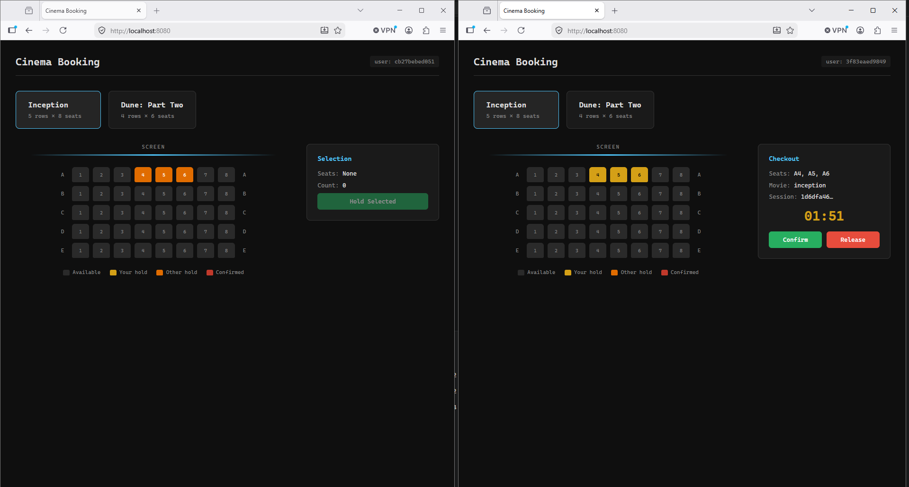

# Cinema Ticket Booking v2

This project demonstrates safe seat booking under high concurrency.

## Feature

- Supports concurrent booking requests.



## Problem

When multiple users try to book the same seat at the same time, race conditions can lead to duplicate bookings.

## Solution

Use Redis Lua scripts to atomically check and reserve seats with TTL.

- Hold script: checks that all requested seats are free, then holds all of them together.
- Confirm script: finalizes the held seats together for the same session.
- Result: supports many concurrent users and multi-seat requests without double-booking or partial success.

## Quick Start

1. Start Redis:

```bash
docker compose up -d redis
```

2. Run the app:

```bash
go run ./cmd
```

3. Open the app:

- UI: http://localhost:8080
- Redis Commander (optional): http://localhost:8081

4. Stop services when done:

```bash
docker compose down
```

## Demo

- Single-seat race: many goroutines try to book the same seat, and only 1 booking succeeds.
- Overlapping multi-seat race: many goroutines request overlapping seat groups, so some bookings succeed and some fail, with no partial success.

Notes: all credit(s) go to https://github.com/SelfMadeEngineerCode 